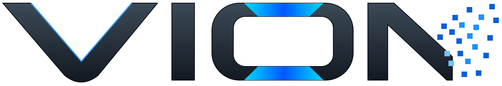

<p align="center">
  
</p>

# ViON - Plugins

Official plugins for the ViON video surveillance platform.

## Model downloads

Detection backends (ONNX, OpenVINO, NCNN, CoreML, Coral, Hailo, YAMNet) download their models on first use.
Set `VION_MODELS_HOST` (for example `https://models.vionvision.tech`) to serve them from your own mirror;
the path layout is `/<version>/<backend>/...`, identical to the upstream host.

## Upstream

Based on [camera.ui plugins](https://github.com/cameraui/plugins) by seydx (MIT), used with the author's permission.
To pull upstream changes:

```sh
git remote add upstream https://github.com/cameraui/plugins.git
git fetch upstream && git merge upstream/main
```

## Plugins

| Plugin                                 | Package                             |
| -------------------------------------- | ----------------------------------- |
| [Coral](camera-ui-coral)               | `@camera.ui/camera-ui-coral`        |
| [CoreML](camera-ui-coreml)             | `@camera.ui/camera-ui-coreml`       |
| [Eufy](camera-ui-eufy)                 | `@camera.ui/camera-ui-eufy`         |
| [Hailo](camera-ui-hailo)               | `@camera.ui/camera-ui-hailo`        |
| [HomeKit](camera-ui-homekit)           | `@camera.ui/camera-ui-homekit`      |
| [NCNN](camera-ui-ncnn)                 | `@camera.ui/camera-ui-ncnn`         |
| [ONNX](camera-ui-onnx)                 | `@camera.ui/camera-ui-onnx`         |
| [ONVIF](camera-ui-onvif)               | `@camera.ui/camera-ui-onvif`        |
| [OpenCL](camera-ui-opencl)             | `@camera.ui/camera-ui-opencl`       |
| [OpenCV](camera-ui-opencv)             | `@camera.ui/camera-ui-opencv`       |
| [OpenVino](camera-ui-openvino)         | `@camera.ui/camera-ui-openvino`     |
| [Pam Diff](camera-ui-pamdiff)          | `@camera.ui/camera-ui-pamdiff`      |
| [Reolink](camera-ui-reolink)           | `@camera.ui/camera-ui-reolink`      |
| [Ring](camera-ui-ring)                 | `@camera.ui/camera-ui-ring`         |
| [Rust Motion](camera-ui-rust-motion)   | `@camera.ui/camera-ui-rust-motion`  |
| [SMTP](camera-ui-smtp)                 | `@camera.ui/camera-ui-smtp`         |
| [Tuya](camera-ui-tuya)                 | `@camera.ui/camera-ui-tuya`         |
| [WASM Motion](camera-ui-wasm-motion)   | `@camera.ui/camera-ui-wasm-motion`  |
| [Wyze](camera-ui-wyze)                 | `@camera.ui/camera-ui-wyze`         |
| [YAMNet Audio](camera-ui-audio-yamnet) | `@camera.ui/camera-ui-audio-yamnet` |

---

_Part of the ViON ecosystem - [vionvision.tech](https://vionvision.tech)._
